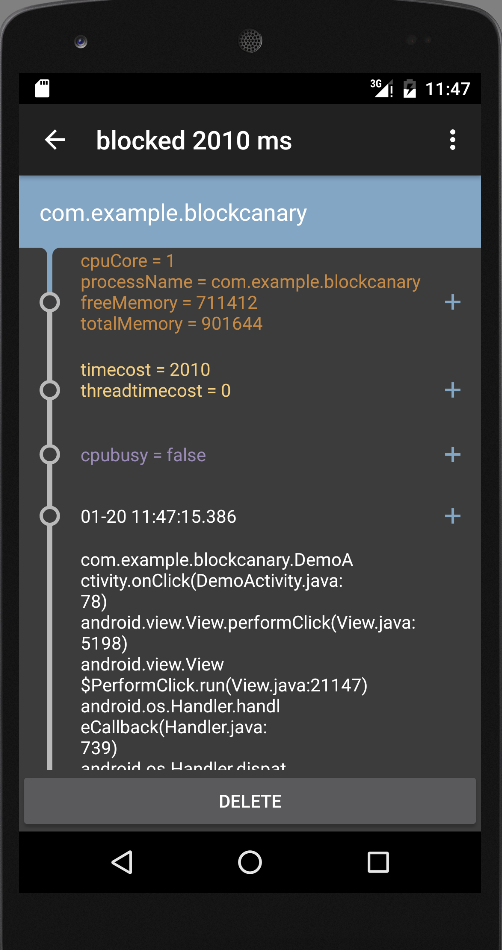

[English](https://github.com/moduth/blockcanary/blob/master/README.md)

# BlockCanary [](https://maven-badges.herokuapp.com/maven-central/com.github.moduth/blockcanary-android)
BlockCanary是一个Android平台的一个非侵入式的性能监控组件，应用只需要实现一个抽象类，提供一些该组件需要的上下文环境，就可以在平时使用应用的时候检测主线程上的各种卡慢问题，并通过组件提供的各种信息分析出原因并进行修复。

取名为BlockCanary则是为了向LeakCanary致敬，顺便本库的UI部分是从LeakCanary改来的，之后可能会做一些调整。

作者：[markzhai](https://github.com/markzhai)

#包介绍
- blockcanary-ui 包括了通知栏和点击通知栏后的activity这些UI信息
- blockcanary-android blockcanary类的一些实现，是不包括UI的
- blockcanary-core 记录block信息的核心实现
- blockcanary-no-op 是空包，为了release打包时不编译进去

# 引入

**一般选取以下其中一个 case 引入即可**

**如果有多个buildTypes需求，请使用 ```buildTypeComple ``` 关键字根据buildTypes组合使用即可**

```gradle
dependencies {
    //case 1: 既要记录，又要notifacation和UI
    compile 'com.github.moduth:blockcanary-ui:1.1.4'

    //case 2: 仅记录卡顿log，不需要notification和UI
    compile 'com.github.moduth:blockcanary-android:1.1.4'

    //case 3: 仅在debug包启用BlockCanary进行卡顿监控和提示
    debugCompile 'com.github.moduth:blockcanary-ui:1.1.4'
    releaseCompile 'com.github.moduth:blockcanary-no-op:1.1.4'

}
```

PS: 由于该库使用了 `getMainLooper().setMessageLogging();`, 请确认是否与你的app冲突.


# 使用方法
在Application中：
```java
public class DemoApplication extends Application {
    @Override
    public void onCreate() {
        ...
        // 在主进程初始化调用哈
        BlockCanary.install(this, new AppBlockCanaryContext()).start();
    }
}
```

实现自己的监控上下文：
```java
public class AppBlockCanaryContext extends BlockCanaryContext {
    // 实现各种上下文，包括应用标示符，用户uid，网络类型，卡慢判断阙值，Log保存位置等
}
```

# 功能及原理
见[BlockCanary — 轻松找出Android App界面卡顿元凶](http://blog.zhaiyifan.cn/2016/01/16/BlockCanaryTransparentPerformanceMonitor/).

# 如何分析log
除了图形界面可以供开发、测试阶段直接看卡顿原因外，更多的使用场景其实在于大范围的log采集和分析：如线上环境和monkey，或者测试同学们在整个测试阶段的log收集和分析。

对于分析，主要可以从以下维度
- 卡顿时间
- 同堆栈的卡顿出现次数
进行排序和归类。

接着说说对各个log分析的过程。
- 首先可以根据手机性能，如核数、机型、内存来判断对应耗时是不是应该判定为卡顿。如一些差的机器，或者内存本身不足的时候。
- 根据CPU情况，是否是app拿不到cpu，被其他应用拿走了。
- 看timecost和threadtimecost，如果两者差得很多，则是主线程被等待或者资源被抢占。
- 看卡顿发生前最近的几次堆栈，如果堆栈相同，则可以判定为是改出发生卡顿，否则需要比较分析。

# Demo工程
**请参考本项目下的demo module，点击三个按钮会触发对应的耗时事件，消息栏则会弹出block的notification，点击可以进去查看详细信息。**  



# 贡献者

该库最初由 [markzhai](https://github.com/markzhai) 创建, 并在 [魔都三帅](https://github.com/moduth) 组织下与 [nimengbo](https://github.com/nimengbo) 和 [zzz40500](https://github.com/zzz40500) 共同维护和更新.

特别鸣谢[Mr.Bao](https://github.com/baoyongzhang), [android-cjj](https://github.com/android-cjj), [chiahaolu](https://github.com/chiahaolu)在项目早期做出的贡献。

# 修改日志
见[CHANGELOG](https://github.com/moduth/blockcanary/blob/master/CHANGELOG.md)

# 贡献

如果你希望贡献代码到BlockCanary，你可以fork本repository然后发一个PR。

# 协议

    Licensed under the Apache License, Version 2.0 (the "License");
    you may not use this file except in compliance with the License.
    You may obtain a copy of the License at

       http://www.apache.org/licenses/LICENSE-2.0

    Unless required by applicable law or agreed to in writing, software
    distributed under the License is distributed on an "AS IS" BASIS,
    WITHOUT WARRANTIES OR CONDITIONS OF ANY KIND, either express or implied.
    See the License for the specific language governing permissions and
    limitations under the License.
